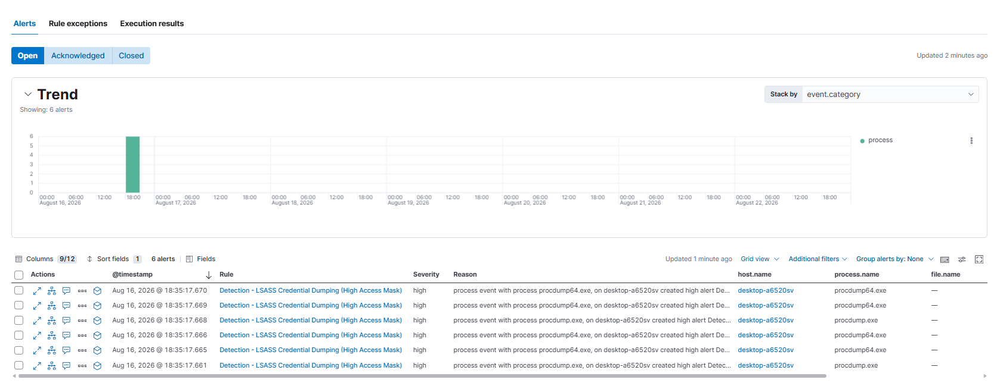
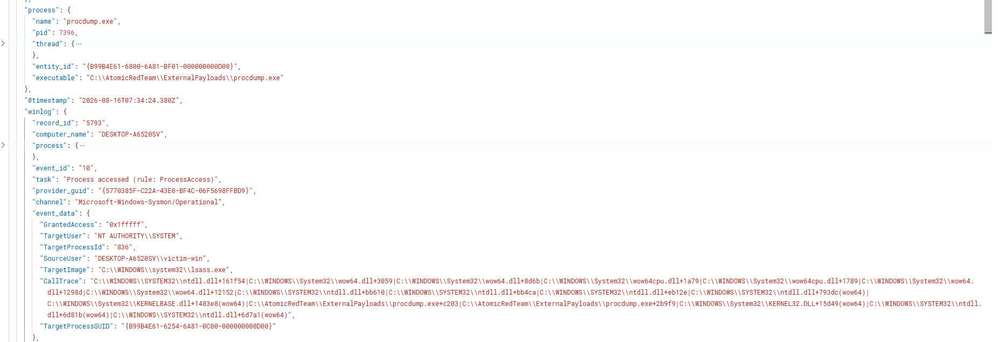

# Incident Report: Simulated LSASS Credential Dumping Detection

**Date:** August 18, 2026
**Analyst:** Dipesh Sapkota
**Environment:** Home SOC Lab (bridged network segment, non-production; attacker on separate physical device)
**Classification:** Simulated / Controlled Test — not a real incident

> Note: This is a condensed detect-to-alert writeup, not a full investigation report. For a complete end-to-end incident investigation example, see [Epoch4 Emotet Installer Investigation] under Projects.

---

## 1. Summary

In a controlled lab environment, a simulated attacker remotely accessed a Windows workstation and attempted to steal stored user credentials directly from the system's memory — a technique commonly used by real attackers after gaining initial access to a network. The monitoring system built for this lab was used to analyze the resulting telemetry and construct a detection rule that correctly and repeatably identifies this credential-theft technique, distinguishing it from routine, benign process activity on the same host. This confirms the detection logic built here would catch this class of attack in a live environment.

## 2. MITRE ATT&CK Mapping

| Tactic            | Technique                                  | ID        |
| ----------------- | ------------------------------------------ | --------- |
| Lateral Movement  | Remote Services: Windows Remote Management | T1021.006 |
| Credential Access | OS Credential Dumping: LSASS Memory        | T1003.001 |

## 3. Simulation Details

- **Attacker source:** Kali Linux (bare metal, HP Notebook 15-r113nx), connected over the lab's bridged network segment
- **Access method:** Evil-WinRM remote session using lab-only local admin credentials
- **Tool used (post-access):** Atomic Red Team
- **Test executed:** `Invoke-AtomicTest T1003.001 -TestNumbers 1` ("Dump LSASS.exe Memory using ProcDump")
- **Target host:** victim-win (Windows 11 Pro, VM on host PC)
- **Timestamp (evidenced telemetry):** August 16, 2026, 08:01:52 UTC

---

## 4. Timeline

This lab was built and executed over several days, and the timeline reflects that honestly rather than compressing it into a single session — the attack was first executed and worked past host defenses on one day, and the detection rule was engineered and validated against captured telemetry on a later day, after a Sysmon logging gap was identified and corrected. This build-then-detect sequence is realistic: a detection rule is normally written *after* observing what the malicious behavior looks like in real telemetry, not before.

| Date (2026) | Phase | Event |
|---|---|---|
| Aug 10–15 | Infrastructure Build | Elasticsearch/Kibana stack, Sysmon, and Winlogbeat deployed and stabilized (see `report.md` for full build details and troubleshooting) |
| Aug 12 | Attack Execution (Attempt) | Evil-WinRM session established from Kali; ProcDump executed against `lsass.exe`. Blocked twice by Windows Defender signature detection (`HackTool:Win32/DumpLsass.E`) |
| Aug 12 | Defense Bypass | Identified and disabled three independent layers blocking the technique: Defender real-time protection, an Attack Surface Reduction rule, and LSA Protection (`RunAsPPL`, requiring a host reboot). First successful memory dump achieved. |
| Aug 16 | Telemetry Gap Identified | Discovered Sysmon was not generating any `ProcessAccess` (Event ID 10) telemetry — the deployed config had an empty inclusion rule. Corrected the Sysmon configuration. |
| Aug 16 | Attack Re-Execution | Re-established the WinRM session and re-ran the ProcDump test (08:01:52 UTC) to generate valid, capturable telemetry |
| Aug 16 | Detection Engineering | Reviewed the resulting Sysmon/Winlogbeat data in Kibana; identified `GrantedAccess` as the distinguishing signal between malicious (`0x1fffff`) and benign (`0x1000`) access to `lsass.exe`; built a custom KQL detection rule on that basis |
| Aug 16 | Alert Validation | Corrected the rule's look-back window (initial configuration didn't cover existing historical telemetry); 6 alerts generated on the next scheduled run, confirming detection |

---

## 5. Detection

- **Telemetry sources:** Windows Security Event ID 4624 (remote logon) + Sysmon Event ID 10 (ProcessAccess), both via Winlogbeat → Elasticsearch

- **Detection logic (KQL):**
```
event.code: "10" and winlog.event_data.TargetImage: *lsass.exe and winlog.event_data.GrantedAccess: "0x1fffff"
```
> Note: the wildcard term must be unquoted in Kibana's query language — quoting a wildcard (`"*lsass.exe"`) makes Kibana search for that literal string instead of applying wildcard matching, which returns zero results even when matching data exists.

- **Supporting correlation query:**
```
event.code: "4624" and winlog.event_data.LogonType: "3"
```

- **Why the access-mask filter matters:** `lsass.exe` is touched constantly by routine Windows processes (e.g. `svchost.exe` performing normal RPC calls, observed at `GrantedAccess: 0x1000`). ProcDump specifically requested `GrantedAccess: 0x1fffff` — full memory access — a materially different and much higher-fidelity signal than "any process touched lsass.exe." Filtering on the access mask, not just the target process, is what separates a usable detection from a rule that would otherwise fire constantly on background noise.

- **Correlation note:** the WinRM remote logon (Event 4624, Logon Type 3, source = Kali laptop) occurred within the same attack session, immediately preceding the LSASS access event. Precise second-level interval was not captured in this pass; the two events are correlated by session and sequence rather than a measured time delta.

- **Alert fired:** Yes — 6 alerts generated matching the detection rule

- **Time to detection:** Not measured in the conventional real-time sense — the detection rule was built retrospectively from captured telemetry, then validated by correcting its look-back window to cover the historical data. In production, this rule runs continuously on its configured schedule and would alert on any future occurrence of this pattern within that interval.



<p align="center"><em>Figure 5.1: Six alerts triggered in Kibana, matching the detection rule.</em></p>

---

## 6. Investigation Notes

- **Source process:** `procdump.exe` (and `procdump64.exe`)
- **Parent process:** `cmd.exe`
- **Command line observed:** `C:\Windows\System32\cmd.exe /c C:\AtomicRedTeam\atomics\..\ExternalPayloads\procdump.exe -accepteula -ma lsass.exe C:\Windows\Temp\lsass_dump.dmp`
- **Target process:** `lsass.exe`, PID 836
- **Access requested:** `0x1fffff` (full access), vs. `0x1000` observed on routine benign access by `svchost.exe`
- **Hash:** Not captured



<p align="center"><em>Figure 6.1: Raw Sysmon Event ID 10 document — ProcDump accessing lsass.exe with GrantedAccess 0x1fffff.</em></p>


<p align="center"><em>Figure 6.2: Query results contrasting the ProcDump access (0x1fffff) against routine svchost.exe access (0x1000) to the same target process.</em></p>

---

## 7. Assessment

- **Confidence:** High — non-standard binary (`procdump.exe`) touching a sensitive process (`lsass.exe`), requesting a full-access handle, originating from a remote administrative session, and correlated with a prior authentication event. All four factors align with known credential-dumping behavior.
- **Severity/impact if real:** Credential access techniques are inherently high severity per MITRE ATT&CK, since dumped credentials enable lateral movement and privilege escalation.
- **False-positive considerations:** Approved EDR agents or backup software might also legitimately request full-access handles to `lsass.exe`. A production version of this rule would need an allow-list for known-good full-access tools to avoid alerting on sanctioned administrative activity.
- **Classification:** True Positive (Simulated)

---

## 8. Recommended Response

- Isolate host from network
- Reset credentials for any accounts with active sessions on the host at time of access
- Investigate parent process origin (how did it get there — phishing, RDP, etc.)
- Review for lateral movement using dumped credentials

---

## 9. Artifacts / Evidence

- [x] Raw Sysmon Event ID 10 log (redacted excerpt below; full document in `evidence/lsass-eventid10-raw.json`)
- [x] Kibana alert screenshot (Figure 5.1)
- [x] Access-mask contrast evidence (Figure 6.2)

**Redacted Sysmon Event ID 10 — key fields only** (host IP/MAC and hostname redacted; full raw document available on request):

```json
{
  "@timestamp": "2026-08-16T08:01:52.291Z",
  "event.code": "10",
  "event.action": "ProcessAccess",
  "process.name": "procdump.exe",
  "process.executable": "C:\\AtomicRedTeam\\ExternalPayloads\\procdump.exe",
  "winlog.event_data.TargetImage": "C:\\WINDOWS\\system32\\lsass.exe",
  "winlog.event_data.TargetProcessId": "836",
  "winlog.event_data.GrantedAccess": "0x1fffff",
  "winlog.event_data.SourceUser": "REDACTED\\victim-win",
  "host.name": "victim-win"
}
```

---

*This report demonstrates the detect → investigate → report cycle at a high level. Full-depth investigation methodology is showcased separately in the Projects portfolio.*
