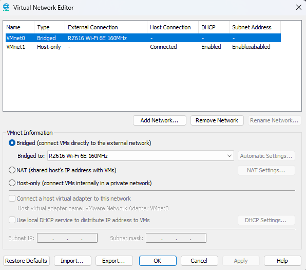
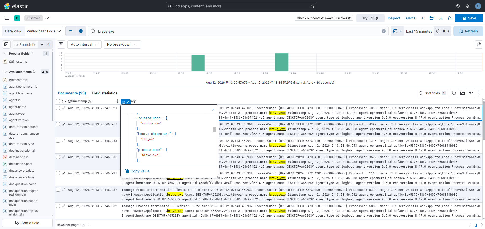
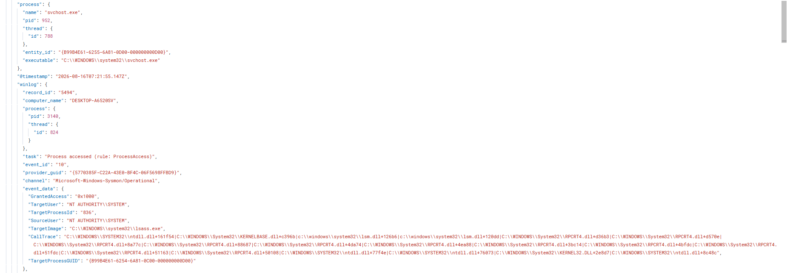
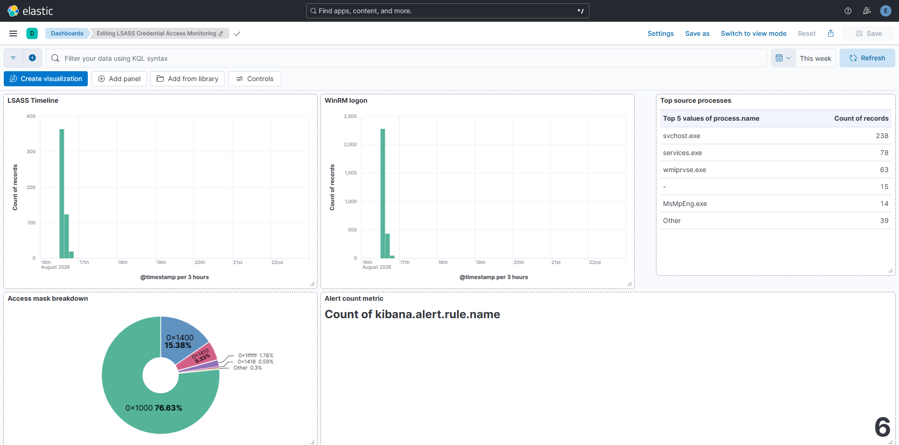
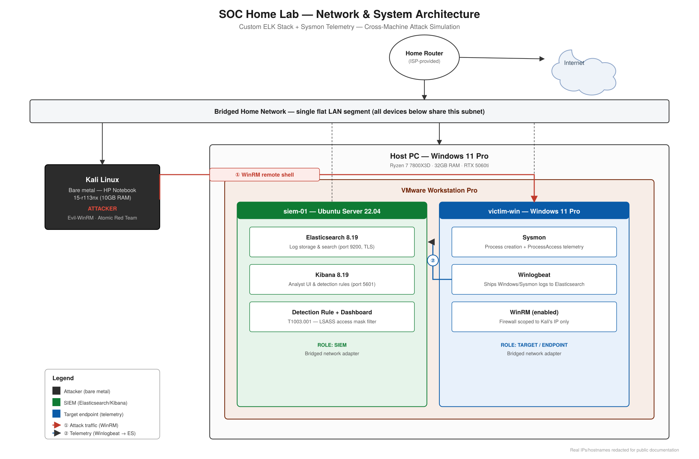

# SOC Home Lab — Custom ELK Stack, Sysmon Telemetry & Credential Dumping Detection

> A SOC lab built from scratch using a hand-configured Elasticsearch/Kibana stack (not an all-in-one distro) to detect a real, cross-machine LSASS credential-dumping attack — executed from a physically separate attacker machine and captured end-to-end through a custom detection rule and dashboard.

---

## Summary

This lab was built to demonstrate hands-on SIEM administration and detection engineering, not just tool familiarity. Rather than deploying an all-in-one SIEM distribution, Elasticsearch and Kibana were installed and configured manually — log forwarding, index management, authentication, and TLS were all hand-built — to develop real operational understanding of how a detection pipeline actually works end to end.

A Windows endpoint (`victim-win`) was instrumented with Sysmon and Winlogbeat, shipping telemetry to a self-hosted Elasticsearch/Kibana stack (`siem-01`). A genuinely separate attacker machine — a Kali Linux laptop running bare metal, not a VM on the same hypervisor — was used to establish a remote WinRM session and execute a credential-dumping technique (MITRE T1003.001) against the endpoint using Atomic Red Team and ProcDump. The resulting telemetry was used to build a custom detection rule, distinguishing the malicious access from routine background noise by its access-mask value, and to build a supporting Kibana dashboard.

---

## Scenario

Rather than a single pre-scripted "detect this alert" exercise, this lab was built as a full pipeline: stand up the infrastructure, instrument the endpoint, generate a real attack from a separate machine, and build detection logic against the resulting live telemetry — including diagnosing and resolving the real infrastructure and defensive obstacles encountered along the way (TLS/cert issues, a corrupted Elasticsearch system index, Windows Defender and LSA Protection blocking the technique, and a Sysmon logging-config gap that initially produced zero telemetry).

- **Environment:** Two physical machines — a Windows 11 Pro host (VMware Workstation Pro, running `siem-01` and `victim-win` as VMs) and a separate Kali Linux laptop running bare metal as the attacker
- **Trigger:** Self-directed build, simulating a T1003.001 (OS Credential Dumping: LSASS Memory) attack chain
- **Scope:** SIEM stack build, endpoint instrumentation, one attack chain (T1021.006 → T1003.001), one custom detection rule, one dashboard

---

## Goals

What this lab aimed to demonstrate:

- [x] Manually build and configure a working Elasticsearch/Kibana stack — authentication, TLS trust, and log forwarding — without relying on an all-in-one SIEM distribution
- [x] Instrument a Windows endpoint with Sysmon and Winlogbeat to generate real, usable telemetry
- [x] Execute a genuine cross-machine attack chain (remote access → credential dumping) from a physically separate attacker device
- [x] Build a detection rule against real attack telemetry, tuned to separate malicious activity from benign background noise
- [x] Visualize the detection in a working dashboard

---

## Skills Demonstrated

- Manual SIEM stack deployment and configuration (Elasticsearch, Kibana — authentication, TLS, index/data view management)
- Windows endpoint telemetry engineering (Sysmon configuration, Winlogbeat log forwarding)
- Attack simulation and adversary emulation (Atomic Red Team, MITRE ATT&CK-mapped technique execution)
- Detection engineering — writing and tuning a KQL detection rule using access-mask-level signal, not just process name
- Log correlation (remote logon → credential access) and dashboard visualization
- Systematic infrastructure troubleshooting: TLS/certificate diagnostics, Elasticsearch cluster health and index recovery, Windows Defender/ASR/LSA Protection analysis, root-causing a Go panic from a raw stack trace

---

## Tools Used

| Tool | Purpose |
|---|---|
| Elasticsearch & Kibana | Self-hosted SIEM backend and analyst UI — manually configured, not an out-of-the-box distro |
| Sysmon | Windows endpoint telemetry (process creation, process access, image loads) |
| Winlogbeat | Log forwarding from the Windows endpoint to Elasticsearch |
| Atomic Red Team | MITRE ATT&CK-mapped attack simulation (T1003.001) |
| Evil-WinRM | Remote shell access from the attacker machine to the Windows endpoint |
| ProcDump (Sysinternals) | Credential-dumping tool used in the simulated attack, executed against `lsass.exe` |
| VMware Workstation Pro | Hypervisor for `siem-01` and `victim-win` |

---

## Technologies & Platforms

- **Operating Systems:** Windows 11 Pro (`victim-win`, endpoint), Ubuntu Server 22.04 LTS (`siem-01`, SIEM host), Kali Linux (attacker, bare metal)
- **Network:** Bridged VMware networking (deliberate departure from full air-gapping, since the attacker is a separate physical device), Windows Firewall scoped to the attacker's IP for WinRM access
- **Hypervisor host:** Windows 11 Pro, Ryzen 7 7800X3D, 32GB RAM, RTX 5060ti
- **Attacker platform:** HP Notebook 15-r113nx running Kali Linux, bare metal
- **Detection stack:** Elasticsearch 8.19.19, Kibana 8.19.19, Winlogbeat 9.5.0

---

## Project Structure

```
soc-home-lab-elk-sysmon/
├── readme.md              ← This file — project overview
├── report.md               ← Full lab build report (setup, config, troubleshooting)
├── incident_report.md      ← Condensed detection/attack simulation writeup
└── screenshots/
    ├── 01-network-adapter-config.png
    ├── 02-kali-ping-test.png
    ├── 03-firewall-scoped.png
    ├── 04-kibana-login.png
    ├── 04-winlogbeat-service.png
    ├── 05-kibana-artifact-encryption.png
    ├── 06-kibana-system-credentials.png
    ├── 07-kibana-tls-cert.png
    ├── 08-sysmon-installed.png
    ├── 09-powershell-logging-enabled.png
    ├── 10-kibana-discover-live.png
    ├── 11-victim-win-activity.png
    ├── 12-winrm-enabled.png
    ├── 13-evilwinrm-connection.png
    ├── 14-defender-detection.png
    ├── 15-procdump-success.png
    ├── 16-sysmon-config-fix.png
    ├── 17-event-4624-remote-logon.png
    ├── 18-detection-rule-config.png
    ├── 19-dashboard-final.png
    ├── 20-alerts-triggered.png
    ├── 21-sysmon-eventid10-lsass-raw.png
    ├── 22-sysmon-eventid10-sourceimage-contrast.png
    └── lab-diagram.png
```

---

## Key Outcomes

- Built a fully manual Elasticsearch/Kibana SIEM stack — including authentication, TLS trust, and log forwarding — without relying on an all-in-one distro
- Instrumented a Windows endpoint with Sysmon and Winlogbeat, correcting an initial Sysmon configuration gap that produced zero `ProcessAccess` telemetry
- Executed a real cross-machine attack chain: WinRM remote access from a bare-metal Kali attacker → Atomic Red Team → ProcDump against `lsass.exe`, working past Windows Defender signature detection, an ASR rule, and LSA Protection (PPL) along the way
- Built a detection rule that isolates the malicious access using its specific access-mask value (`0x1fffff`), distinguishing it from routine, benign `lsass.exe` access by legitimate OS processes (`0x1000`)
- Produced a working Kibana dashboard correlating the remote-logon and credential-access events on a shared timeline
- Documented 19 real infrastructure/troubleshooting issues with root cause and fix — see `report.md`

---

## Screenshots

**Figure 1 — Bridged network configuration and attacker-to-endpoint reachability confirmation**



**Figure 2 — Kibana Discover showing live Sysmon telemetry flowing in from the endpoint**



**Figure 3 — Detection rule isolating the ProcDump LSASS access by access-mask value, vs. routine background access**



**Figure 4 — Final dashboard: timeline correlation, access-mask breakdown, source-process table, alert count**



---

## Diagram



> *Diagram: Two-physical-machine architecture — a Windows 11 Pro host running `siem-01` (Elasticsearch/Kibana) and `victim-win` (Sysmon-instrumented endpoint) as VMware VMs, bridged onto the same network segment as a separate bare-metal Kali Linux attacker laptop.*

---

## Full Report

The complete lab build — architecture, manual SIEM configuration, endpoint instrumentation, the attack chain, detection rule construction, and all 19 troubleshooting entries with root cause and fix — is documented in [`report.md`](./report.md).

For the condensed detect-to-alert writeup specifically, see [`incident_report.md`](./incident_report.md).
