# Lab: Building a SOC Home Lab from Scratch (Custom ELK + Sysmon)

**Category:** Labs
**Date:** August 12–18, 2026
**Author:** Dipesh Sapkota
**Repo/Links:** <!-- GitHub folder link -->

---

## 1. Objective

Build a self-contained SOC lab from scratch — manually configuring the SIEM stack and log forwarding pipeline — to demonstrate hands-on understanding of telemetry collection, log shipping, and detection engineering fundamentals.

---

## 2. Architecture
&nbsp;

<em>Figure 2: Lab Architecture Diagram.</em>

&nbsp;

| Machine | Role | Specs | OS |
|---|---|---|---|
| siem-01 (VM) | Elasticsearch + Kibana | 4 vCPU / 8GB / 60GB | Ubuntu Server 22.04 |
| victim-win (VM) | Telemetry source / attack target | 4 vCPU / 8GB / 80GB | Windows 11 Pro |
| attacker (bare metal) | Attack execution | 10GB RAM | Kali Linux, HP Notebook 15-r113nx |

**Hypervisor host:** Ryzen 7 7800X3D / 32GB RAM / ~2TB SSD (NVMe + SATA) / VMware Workstation Pro
**Network:** Bridged mode (VMs share the home LAN subnet with the physical Kali attacker machine), scoped Windows Firewall rules restricting lab ports to the attacker's IP only. Documented as a deliberate tradeoff vs. full air-gapping, since the attacker is a separate physical device. Real IPs redacted in published screenshots.

---

## 3. Tools & Versions

| Tool | Version | Purpose |
|---|---|---|
| VMware Workstation Pro | — | Hypervisor |
| Ubuntu Server | 22.04 LTS | SIEM host OS |
| Elasticsearch | 8.19.19 | Log storage/search |
| Kibana | 8.19.19 | SIEM UI/visualization |
| Sysmon | 15.21 | Windows endpoint telemetry |
| Winlogbeat | 9.5.0 | Log forwarder |
| Atomic Red Team | — | Attack simulation |
| Evil-WinRM | — | Remote shell access from attacker to target |
| ProcDump (Sysinternals) | — | Credential-dumping tool used in the simulated attack |

---

## 4. Build Walkthrough

### 4.1 Network Setup (Bridged + Scoped Firewall)

  

    
    
Figure 4.1.1: Virtual adapter configuration (bridged mode).

  

  

    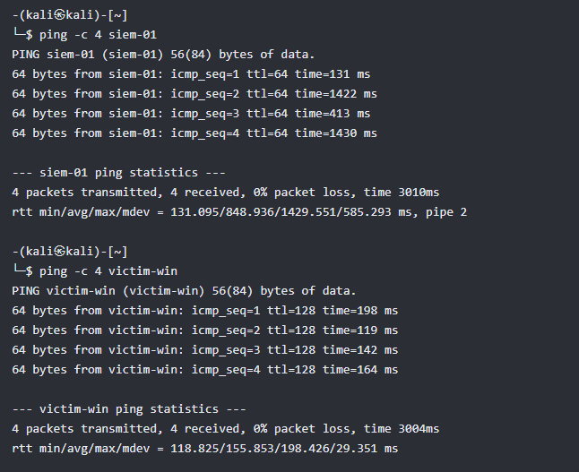
    
Figure 4.1.2: Kali Linux reachability test to both VMs.

  

  

    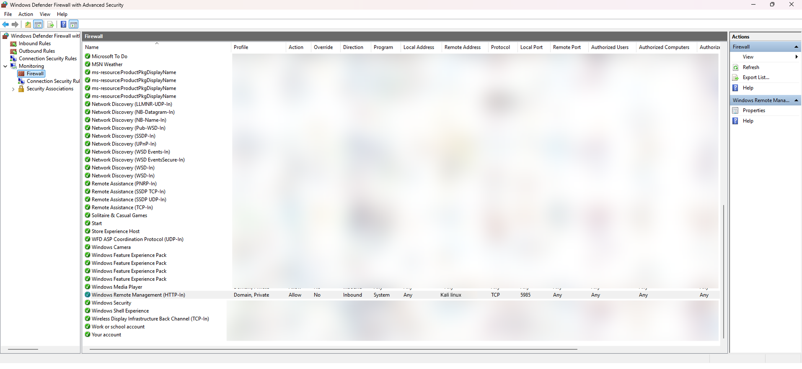
    
Figure 4.1.3: Windows Firewall WinRM rule scoped to the Kali IP.

  

**Description:**
To connect a physically separate Kali Linux machine to the `victim-win` host, a bridged network configuration was required. To enforce a secure testing perimeter, the Windows Firewall on `victim-win` was strictly scoped to accept inbound WinRM connections exclusively from the Kali Linux IP address. This firewall restriction prevents unauthorized lateral movement, rogue interactions, or unintended traffic exposure from other systems on the network during assessment windows.

&nbsp;

---

### 4.2 SIEM Stack (Elasticsearch + Kibana)
&nbsp;

<em>Figure 4.2.1: Kibana healthy cluster / login.</em>

&nbsp;

  

    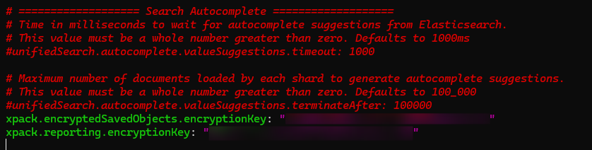
    
Figure 4.2.2: Kibana security artifact encryption configuration.

  

  

    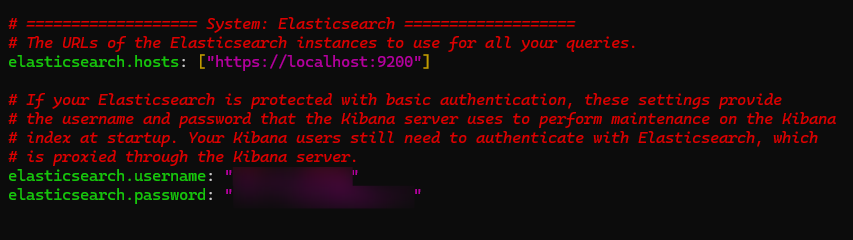
    
Figure 4.2.3: Kibana system credential setup.

  

  

    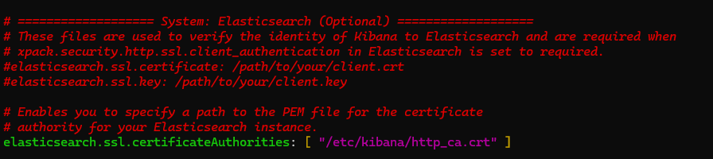
    
Figure 4.2.4: Manually adding the self-signed certificate for TLS trust.

  

**Description:**
Figure 4.2.2 demonstrates how Elasticsearch encrypts internal security artifacts, such as API keys and saved credentials, to prevent unauthorized access to Kibana's own configuration.

Figure 4.2.3 illustrates the setup and password generation for the built-in `kibana_system` service account, which establishes the authentication layer required for Kibana to communicate with the Elasticsearch cluster.

Figure 4.2.4 details the manual installation of Elasticsearch's self-signed TLS certificate into Kibana's trust store, needed to establish a trusted HTTPS connection between the two services.
&nbsp;

---

### 4.3 Windows Endpoint Instrumentation (Sysmon + PowerShell Logging)

  

    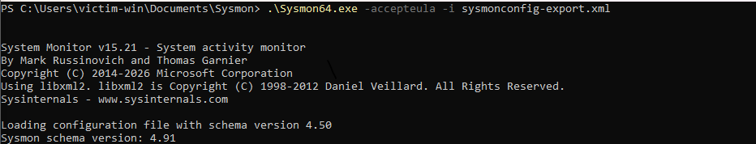
    
Figure 4.3.1: Sysmon installed on the Windows endpoint.

  

  

    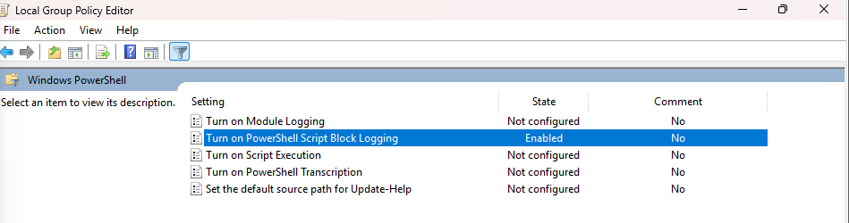
    
Figure 4.3.2: PowerShell Script Block Logging enabled.

  

**Description:**
Figure 4.3.1 shows the successful installation of Sysmon on the Windows endpoint as part of the custom ELK stack for security event monitoring.
Figure 4.3.2 shows PowerShell logging enabled to capture detailed script execution activity, which is collected through Winlogbeat and forwarded to Elasticsearch for analysis.
These configurations provide the endpoint event data needed for visualization and monitoring in Kibana.

&nbsp;

---

### 4.4 Log Forwarding Validation

  

    
    
Figure 4.4.1: Kibana Discover showing live indexed events.

  

  

    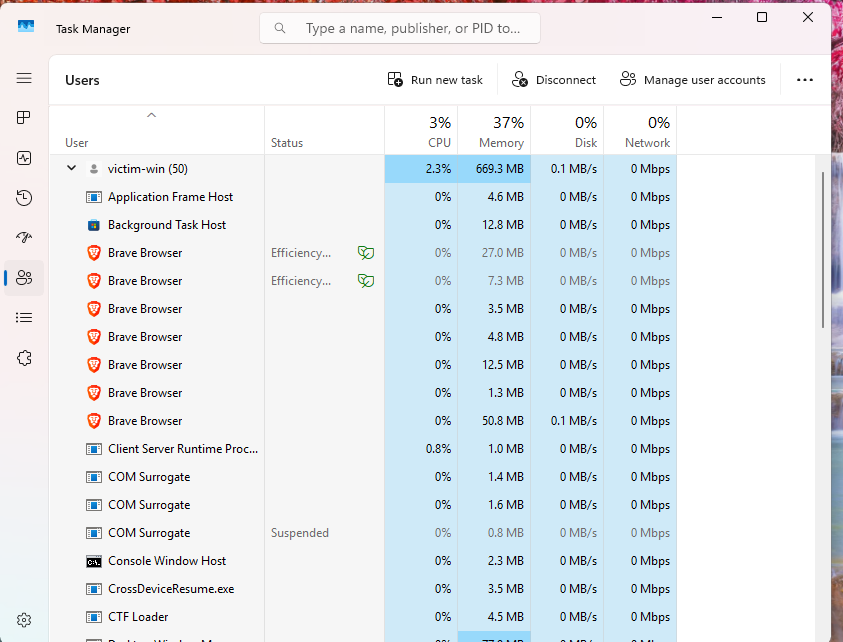
    
Figure 4.4.2: Corresponding source activity (brave.exe) on victim-win.

  

**Description:**
Figure 4.4.1 presents Kibana Discover filtered to `related.user: victim-win` and the `brave.exe` process, demonstrating that endpoint events are being received and indexed by the ELK stack. Figure 4.4.2 shows Task Manager on `victim-win`, where `brave.exe` is actively running, providing the corresponding source activity. The correlation between the observed endpoint process and the logs displayed in Kibana validates that the log forwarding pipeline — from the Windows endpoint, through Winlogbeat and Elasticsearch, to Kibana — is functioning correctly.

&nbsp;

---

### 4.5 Attack Simulation & Detection Engineering

With the pipeline validated, a real cross-machine attack chain was executed to generate genuine attack telemetry and build a detection rule against it, rather than relying on synthetic or documentation-only examples.

**Remote access setup.** WinRM was enabled on `victim-win` and its firewall rule scoped to the Kali attacker's IP address (Section 4.1). From Kali, an Evil-WinRM session was established using lab-only local admin credentials, providing a remote shell on the target — the same access pattern a real attacker would establish after an initial compromise.

  

    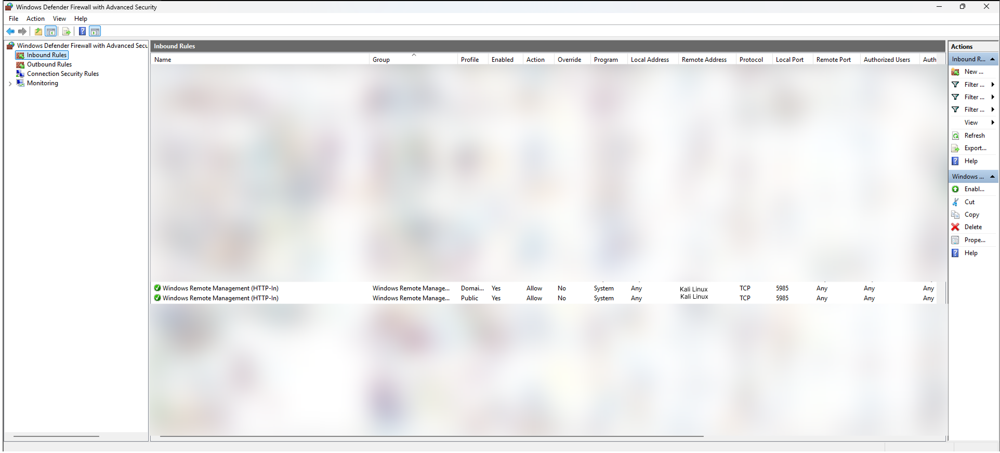
    
Figure 4.5.1: WinRM enabled and firewall exception configured on victim-win.

  

  

    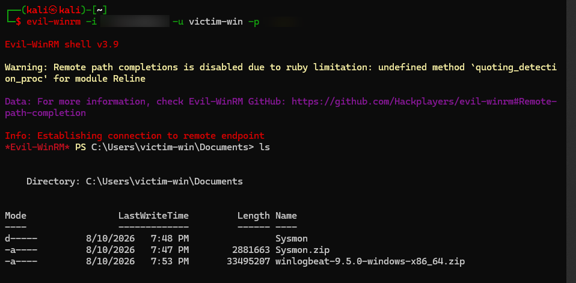
    
Figure 4.5.2: Successful Evil-WinRM remote session from Kali.

  

**Attack execution.** From the remote session, Atomic Red Team was installed and used to execute a MITRE ATT&CK-mapped credential-dumping technique — T1003.001, "OS Credential Dumping: LSASS Memory" — using ProcDump against `lsass.exe`. This did not succeed on the first attempt: the endpoint's built-in defenses blocked it at three independent layers before a successful dump was achieved — Windows Defender's signature-based detection, a dedicated Attack Surface Reduction rule for LSASS credential theft, and LSA Protection (`RunAsPPL`), which runs `lsass.exe` as a Protected Process Light and blocks memory access even from a fully privileged token. Each was identified and addressed in turn (full detail in Section 5, Challenges & Fixes).

  

    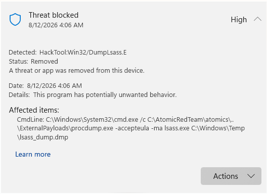
    
Figure 4.5.3: Windows Defender's independent detection (HackTool:Win32/DumpLsass.E) prior to exclusions being added.

  

  

    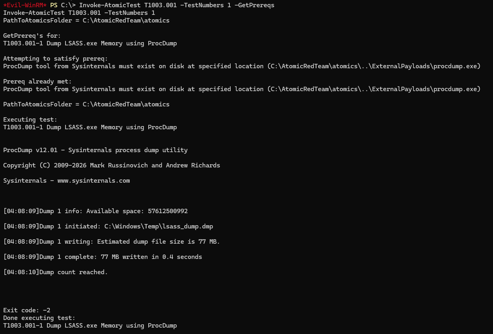
    
Figure 4.5.4: Successful ProcDump execution against lsass.exe.

  

**Closing the telemetry gap.** After a successful dump, review of the SIEM showed zero Sysmon `ProcessAccess` (Event ID 10) events had been captured — the deployed Sysmon configuration had an empty `<ProcessAccess onmatch="include">` rule, which logs nothing by default until explicitly told what to include. A rule targeting `lsass.exe` was added and the configuration reapplied, after which the attack was re-executed to generate valid, capturable telemetry.

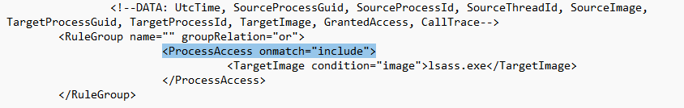

<em>Figure 4.5.5: Corrected ProcessAccess rule in the Sysmon configuration.</em>

**Detection rule construction.** With real telemetry in hand, Kibana Discover was used to compare the malicious ProcDump access against routine, benign `lsass.exe` access by legitimate OS processes (e.g. `svchost.exe`). The two were cleanly separated by the Windows access-rights mask requested: ProcDump requested `0x1fffff` (full memory access) versus `0x1000` (a narrow, routine query) for ordinary RPC activity. A custom KQL detection rule was built on this distinction, mapped to MITRE ATT&CK T1003.001, and validated — its initial look-back window didn't cover existing historical telemetry, which was corrected before the rule successfully generated 6 alerts.

  

    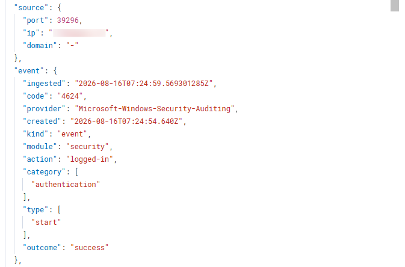
    
Figure 4.5.6: Event 4624 (remote logon, Type 3) correlating with the LSASS access.

  

  

    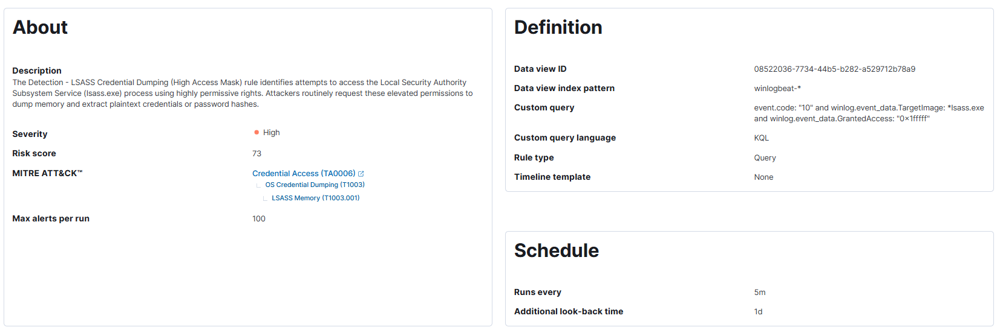
    
Figure 4.5.7: Detection rule configuration, including MITRE ATT&CK mapping.

  

**Dashboard.** A Kibana dashboard was built to visualize the detection: a timeline of LSASS access events, an access-mask breakdown (isolating the attack from routine noise), a source-process table, and an aligned timeline of the WinRM remote-logon events for visual correlation against the credential-access spike.

<em>Figure 4.5.8: Final dashboard — timeline correlation, access-mask breakdown, source-process table, and alert count.</em>

&nbsp;

---

## 5. Challenges & Fixes

| Issue | Root Cause | Fix |
|---|---|---|
| `elasticsearch-reset-password` failed with SSL handshake error | DHCP renewed the VM's IP; Elasticsearch's auto-generated cert no longer matched the new IP | Ran the command against `--url https://localhost:9200` instead of the LAN IP |
| Winlogbeat service failed with a Go panic | `winlogbeat.yml` listed `Microsoft-Windows-PowerShell/Operational` twice, causing a duplicate metrics-registry collision | Merged the two entries into one |
| Kibana stuck on "server not ready" for 5+ minutes | `.kibana_task_manager` and `.kibana_usage_counters` system indices were corrupted (Lucene format exception) | Deleted the corrupted indices so Kibana could recreate them clean |
| Couldn't delete corrupted indices — `security_exception` (403) | Elasticsearch blocks even superusers from directly modifying "restricted" system indices | Created a temporary role/user with explicit `allow_restricted_indices` access, deleted, then removed the temp account |
| `evil-winrm` command not found despite apt showing it installed | Broken Debian/Kali packaging — gemspec existed on disk but wasn't registered in Ruby's active gem path | Installed directly via `gem install evil-winrm`, bypassing the broken apt integration |
| `gem install evil-winrm` failed building native extension | Missing Ruby development headers (`ruby.h`) needed to compile the `syslog` gem dependency | Installed `ruby-dev` and `build-essential` |
| `Enable-PSRemoting` failed with a firewall error | Windows network adapter was categorized as "Public," which blocks the WinRM firewall exception | Changed the network profile to "Private" |
| `Install-AtomicRedTeam` hung indefinitely | Hidden PSGallery/NuGet trust confirmation prompt that Evil-WinRM's non-interactive session couldn't display | Re-ran with `-Force` to skip the confirmation |
| ProcDump failed with "Access is denied" on launch | Windows Defender signature-detected the tool (`HackTool:Win32/DumpLsass.E`) and removed it on arrival | Disabled real-time protection and added exclusions for the test folders |
| `Set-MpPreference` silently had no effect | Tamper Protection blocks scripted changes to Defender settings by design | Disabled Tamper Protection via the Windows Security GUI on the VM console (scripted changes are intentionally blocked) |
| ProcDump ran but still got "Access is denied" opening `lsass.exe` | LSA Protection (`RunAsPPL`) runs `lsass.exe` as a Protected Process Light, blocking handle access even for a full-admin token | Disabled `RunAsPPL` via registry and rebooted (required for the change to take effect) |
| No Sysmon Event ID 10 ever appeared, even locally | The deployed Sysmon config had an empty `<ProcessAccess onmatch="include">` rule — logs nothing by default until explicitly told what to include | Added an explicit `TargetImage: lsass.exe` rule and reapplied the config |
| Notepad edit to the Sysmon config didn't save | GUI apps launched through a WinRM session aren't interactive/visible — nothing was actually on-screen to edit | Edited the file via PowerShell text replacement instead of a GUI editor |
| KQL query returned 0 results despite the data existing (confirmed via direct Elasticsearch API) | Quoting a wildcard value in KQL (`"*lsass.exe"`) makes Kibana search for that literal string, asterisk included, instead of treating it as a wildcard | Removed the quotes around the wildcard term |

---

## 6. Skills Demonstrated

- Hypervisor networking & lab segmentation
- Manual SIEM stack deployment (Elasticsearch/Kibana) without a pre-built distro
- Windows endpoint telemetry configuration (Sysmon, PowerShell script block logging)
- Log forwarding/parsing pipeline configuration (Winlogbeat)
- Adversary emulation using MITRE ATT&CK-mapped techniques (Atomic Red Team)
- Detection engineering — building and validating a KQL rule from real captured telemetry
- Windows endpoint defense analysis (Defender, ASR rules, LSA Protection)
- Kibana dashboarding and event correlation
- Snapshot-based reproducible lab environment management

---

## 7. Time Spent

`August 12 – 18, 2026`
